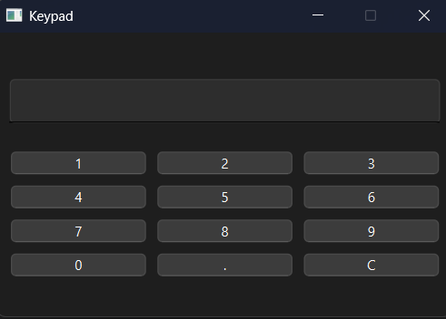

# NumericKeyboard

A simple and working numeric keyboard


## Run Locally

Clone the project

```bash
  git clone https://github.com/Stefan-Dr/NumericKeyboard.git
```

Open QTCreator and open 

```bash
  CMakeLists.txt
```

